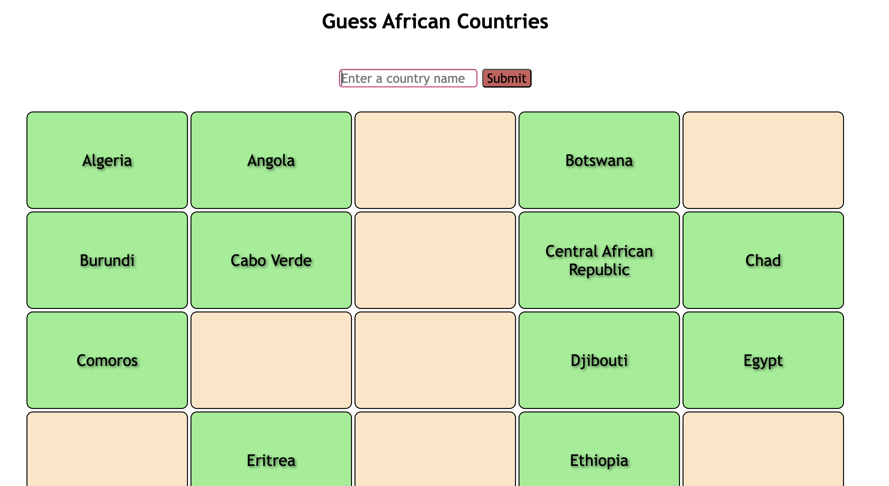

# Guess African Countries

- The user is met with 54 blank boxes and an empty entry box
- The user guesses the country and clicks enter or hits submit
- If correct, the box of the country guessed turns green
- If not, nothing happens

### Possible ideas for development
- Add a timer (54 countries in 5 minutes?)
- The countries not guessed go red at the end of the timer

- Include alternative names of some countries e.g Cote D'Ivore == Ivory Coast
- Allow abbreviations of the countries as well e.g "Democratic Republic of Congo" == "DRC"
