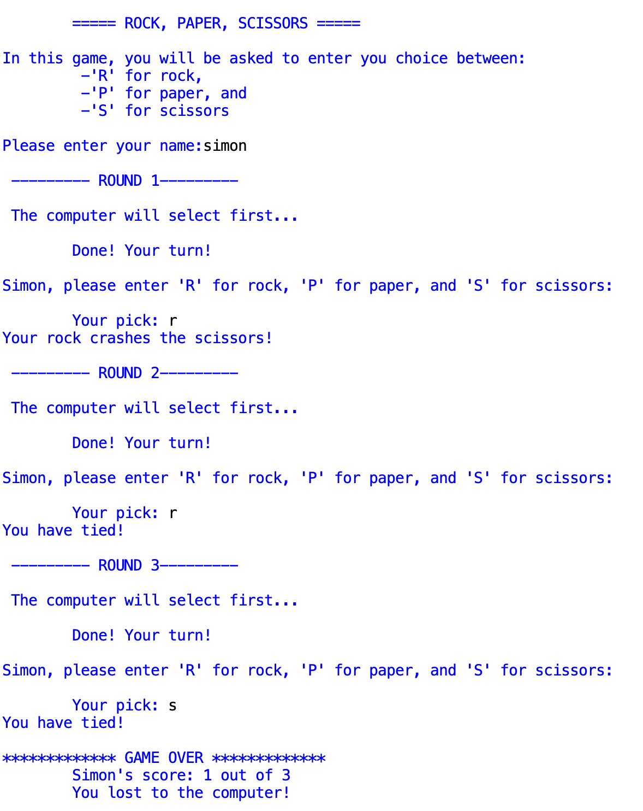

## ROCK, PAPER, SCISSORS
- This game allows the player to go against the computer for 3 rounds.
- In each round, the computer goes first. It selects and does not inform the user until he/she plays
- There is a time delay and the result is shown. 

- The player has the option to repeat as many times as he/she wants.

### Potential for improvement:
- Use graphics... maybe tkinter or even JS?
- Allow to users to play -> use masking to hide the other's input
